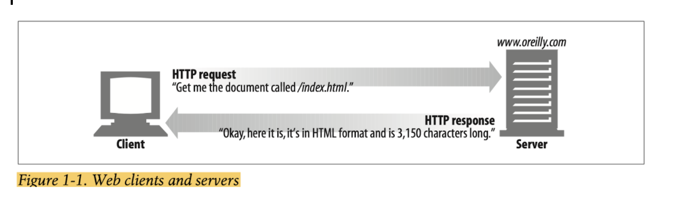

- Projeyi initialize ettik. `npm init -y`

- Paketleri yüklemek için. `npm install`

- Web'de içerik sunabilmek için web server ayağa kaldırmamız gerekiyor. Bunun için `https://www.npmjs.com/package/http-server` şöyle hazır bir kütüphane bulup bilgisayarımız global olarak yükledik. Sonrada package json'a `serve` adlı
bir komut ekleyip projemizi `npm run serve` şeklinde çalışacak hale getirdik.

- İstek attığımız yeri `https://jsonplaceholder.typicode.com/posts` olarak belirledik.